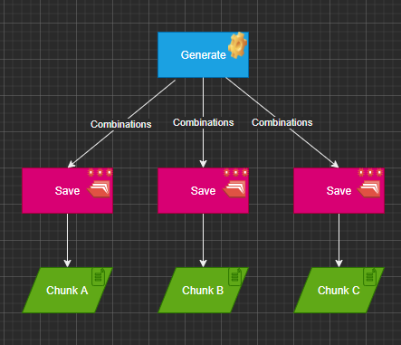
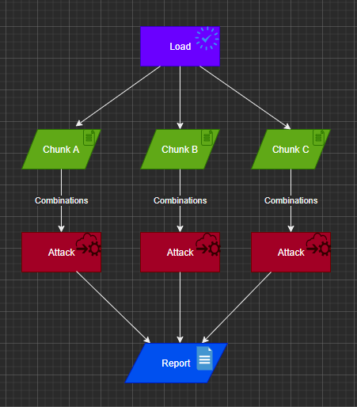

## Brutal
A simple PHP Toolkit to **parallel** generate combinations, save and use the generated terms to apply [brute force attack](https://owasp.org/www-community/attacks/Brute_force_attack) via the http protocol.

Brutal use a simple combination algorithm to generate unique and limited number of combinations in chunk files<br/>

## Installation

**Under construction* <br>

`Brutal` is written in PHP and distributed as package via `composer`. Make sure you have PHP (>= 7.3) installed.

Using composer:

```Bash
composer install brutal
```

## Using Brutal

### Generating and saving combinations dictionaries:
<p align="center">
           
<p>


```PHP
//Instance BrutalService (the facade)
$brutalService = new BrutalService();

//Call generate and pass an implementation of Combinable interface, an array of words and the size of combination
$combinations = $brutalService->generate(new SimpleCombination(), ['0', '1', '2', '3', '4', '5', '6', '7', '8', '9'], 3);

//Create a concrete repository of Combination and pass the combinations generated, a path to save the combinations and the format of content
$from = '/tmp/brutal';
$combinationRepository = CombinationRepositoryFactory::createRepository($combinations, $from, CombinationRepository::FORMAT_TEXT);

//Call save method passing the concrete repository
$brutalService->save($combinationRepository);
```
### Loading dictionaries chunks, attacking the target and reporting results
<p align="center">    
    
<p>

```PHP
//Create a concrete repository of Loader and pass the path where saved the combinations
$loadRepository = LoadRepositoryFactory::createRepository($from);
//Load chunks calling load method and passing concrete load repository
$chunks = $brutalService->load($loadRepository);

//Instance HttpOptions passing the http target, method, format, body and headers (optional). Use '$term' where you need override to generated combination term
$httpOptions = new HttpOptions('http://localhost:3000/test_server.php', 'POST', HttpFormat::JSON, ['test' => '$term']);
//Create a concrete attack repository calling HttpAttackFactory and passing $httpOptions
$httpAttackRepository = HttpAttackRepositoryFactory::createRepository($httpOptions);
//Call attack method passing the concrete attack repository and loaded chunks
$attackResult = $brutalService->attack($httpAttackRepository, $chunks);

//Create a concrete report repository passing http options
$reportRepository = CLIReportRepositoryFactory::createRepository($httpOptions);
//Call report method passing the concrete report repository and attack results
$brutalService->report($reportRepository, $attackResult);

//You can run the test_server.php to test this

```
Try it at [hack a infosec](https://hack.ainfosec.com/) first programming challenge.<br>
Look at brutal_hackinfosec.php file(put your cookie on GET_YOUR_REQUEST_COOKIE_FROM_YOUR_BROWSER) to help you 😁 

## Using Brutal CLI
**Under construction*
### To generate combinations
```Bash
$ php brutal.php generate <options>
```
### Generate options:

* `-c` : Characters token separeted comma to generate combinations term.
* `-s` : Size of generated terms.
* `-p` : Output path of generated combinations.
* `-i` : Type of output file(s) `chunk or single`. Default is chunk.
* `-f` : Format of combinations file(s) content `TEXT or SERIALIZED`. Default is text.
* `-r` : Maximum ram memory in megabytes (important increase to generate and attack higher volume of combinations)
* `-v` : Verbose mode.
  
### Examples:
Generate combination of *0,1,2,3,4,5,6,7,8,9* with size 3 and save in path /home/user/chunks inside multiple chunks text files: <br>
```Bash
$ brutal generate -c 0,1,2,3,4,5,6,7,8,9 -s 3 -p /home/user/chunks -i chunk -f TEXT
```

Generate combination of *0,1,2,3,4,5,6,7,8,9* with size 3 and save in path /home/user/chunks inside multiple chunks using maximum of 700 megabytes ram text files: <br>
```Bash
$ brutal generate -c 0,1,2,3,4,5,6,7,8,9 -s 3 -p /home/user/chunks -i chunk -r 700 -f TEXT
```

Generate combination of *a,b,c,d* with size 4 and save in path /home/user inside single serialized file: <br>
```Bash
$ brutal generate -c a,b,c,d -s 4 -p /home/user -i single -f SERIALIZED
```


### Attacking target
```Bash
$ php brutal.php attack <options>
```
### Attack options:

* `-t` : Target HTTP(s) to execute attack.
* `-p` : Chunks path or specific generated file.
* `-m` : HTTP method.
* `-f` : Format of request `json or form-params`.
* `-b` : Content body. Use `$term` to replace string by generated combinations term.
* `--headers` : Request headers.
* `-r` : Maximum ram memory in megabytes (important increase to generate and attack higher volume of combinations)
* `-v` : Verbose mode.
  
### Examples:
Attack from chunks combination generated in folder /home/user 
to target http://target.test with method POST and json body (note $term matches each combination term inside chunk file): <br>
```Bash
$ brutal attack -p /home/user -t 'http://target.test' -m POST -f json -b ['user' => 'root', 'password' => '$term']
```

Attack from specific generated in file /home/user/combination 
to target http://target.test with method POST using header User-Agent, Host and Cookie with form params body: <br>
```Bash
$ brutal attack -f /home/user/combination -p 'http://target.test' -m POST --headers ['User-Agent' => 'Test', 'Host' => 'test.local', 'Cookie' => 'qwerty123'] -f form-params ['user' => 'root', 'password' => '$term']
```

## Contribute
To customize and add new features consider extends (open-closed principle) following steps: <br>
1. **Generate** <br>
   BrutalService::generate(Combinable) : Combinations <br>
   Build your custom combination algorithm implementing Combinable interface to generate terms
2. **Save**
   BrutalService::save(CombinationRepositoryInterface, $chunk = true) : void<br>
   Build your custom saver algorithm implementing CombinationRepositoryInterface
3. **Load**<br>
   BrutalService::load(LoadRepositoryInterface) : Chunks<br>
   Build your custom loader algorithm implementing LoadRepositoryInterface
4. **Attack**<br>
   BrutallService::attack(AttackRepositoryInterface $attackRepository, Chunks $chunks) : array <br>
   Build your custom attacker algorithm implementing AttackRepositoryInterface
5. **Report**<br>
   BrutalService::report(ReportRepositoryInterface $report, array $attackResult)
   Builder yout custom reporter implmenting ReportRepositoryInterface 


